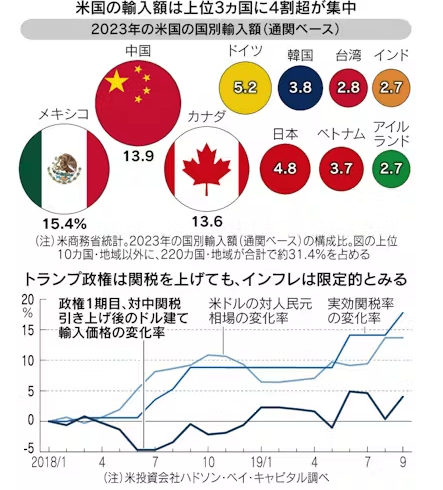

**自動車関税について**  
[この自動車への関税について、ラトニック商務長官は14日、FOXビジネスネットワークのインタビューで「日本や韓国、ドイツに対しても来月2日から関税が発動されるのか」と問われ「すべての国から輸入される車に関税を課すべきだ。それが重要な点だ」と述べました。](https://www3.nhk.or.jp/news/html/20250315/k10014750601000.html)
日本からアメリカへの自動車輸出額は6兆円あまり．現在の2.5%の関税が25%に引き上げられれば，産業全体に打撃を与える可能性が高い．

**鉄鋼とアルミニウムについて**  
[トランプ米大統領は、鉄鋼とアルミニウムに対する関税に例外を設けるつもりはないと述べた。４月２日に相互関税と分野別関税を課す意向も示した。](https://jp.reuters.com/markets/commodities/B3IAYLCVP5LTHIHFLA2W5LBXTE-2025-03-17/)

[タイトルは「世界貿易システム再構築のための取扱説明書」。トランプ政権1期目の18年から19年の対中関税引き上げが、米ドルの対人民元相場やドル建てでみた米国の輸入物価にどのような変化を与えたかを分析している。
これによると、中国からの輸入品に対する実効関税率は17.9%上昇する一方、米ドルの対人民元相場も13.7%上昇したため、関税込みの輸入物価は4.1%の上昇にとどまった。「言い換えれば、為替の変動が高関税の4分の3以上を相殺し、物価上昇圧力を無視できる」との説明だ。](https://www.nikkei.com/article/DGKKZO86882310R20C25A2TCR000/)

関税を引き上げてもドル高により輸入価格が下がり，結果インフレを抑えられるという考え方をしている．
ゲーム理論を応用した国際政治経済学を専門とする東大経済学部の古沢泰治教授は「関税を引き上げても物価がほとんど上昇しないことがある、というのは理論的には正しい」と話す。

つまりこういうことだ。例えば、米国が日本から輸入する鉄鋼の関税を引き上げる。すると、米国内では関税込みの鉄鋼価格が上がるので需要が減る。日本産の鉄鋼需要が減れば価格は下がり、日本から鉄鋼を買うための円の需要も弱まる。その分、円安・ドル高の方向に作用する。結果的に、ドル建ての鉄鋼価格はドル高で相殺され、米国内での日本産の鉄鋼価格はほとんど上がらない――。

「しかし」と古沢氏は付け加える。ドル相場は様々な要因によって形成され、関税よりも利子率の差に左右される。「金融資産の取引はモノの取引よりも、ずっと規模が大きい。関税率よりも米連邦準備理事会（FRB）がインフレにどう対処するかの方がドル相場への影響は大きい」

→関税報復合戦になると前提が崩れるらしい．
→仮にインフレになっても一時的という見方が多い

関税発動を見越した駆け込み需要あり．
上海発米国行きのコンテナ運賃は大幅に下落している．
なお，運賃下落には新造船が供給されたことによる不足感の解消の影響もあり．
駆け込みの動きは春節以降は鈍ったとの見方．急減しているわけではない．
