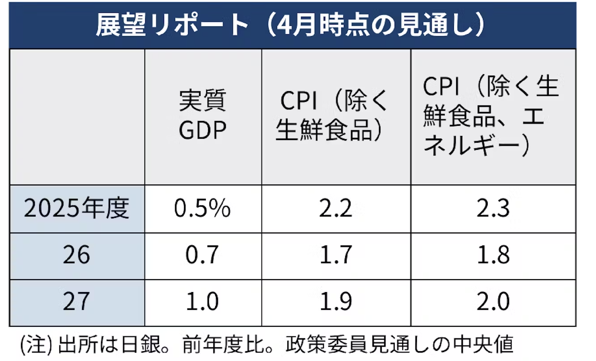

**日銀金融政策決定会合**

**予想：**

- 政策金利0.5%据え置き
- GDP予想成長率を下方修
- 1月時点25年度成長率予想：1.1%
- 1月時点26年度成長率予想：1.0%
- トランプ関税政策の不確実性のため，追加利上げに動きにくい

**結果：**

- 政策金利0.5%据え置き
- 25，26年度のGDP成長率が前年度比1%下回るとの見通し
- 25年度0.5%
- 26年度0.7%
- CPI予想も下方修正

テスタさんの楽天証券口座が乗っ取り被害にあったらしい．早期に気づいたため金銭被害なし？
https://x.com/tesuta001/status/1917736001101001180

テスラ取締役会，イーロンマスクCEOの交代を検討？

Google NotebookLM Gemini2.5Proを基盤にしている

米GDP 1-3月期 前期比-0.3%  
関税前の駆け込みで輸入急増が原因  
純輸出 = 輸出 - 輸入が成長率を4.83P押し下げ  
トランプ「バイデン政権のせい」  
→景気を気にしている発言なので，中間選挙に向けて景気刺激策を出してくることが期待できる．

4-6月期もマイナス予想（楽天証券窪田氏）  
→田中さんは揺り戻しがあると予想．GDPNowもプラス圏に戻っている．

台湾GDP 1-3月期+5.37% 予想3.46%  
駆け込みで対米輸出が増加  
→米GDPが輸入増加でマイナスになったことと整合している
→揺り戻しがあるとすると，ハイテク関連など米国が多く輸入している物資に顕著に現れる？対米輸出が大企業の1Q決算はまずいか？

東京エレクトロン26年3月期プラス成長予想
中国向け減少もAI向けが補う．
トランプ関税の影響は織り込まず．米向け8％なので影響あっても限定的．
顧客の半導体メーカーの投資計画にも変更なし
→対中国の企業は厳しそう

4/23インド株は最高値
→資金が入るところに入っている．

田中さん
1. トランプ関税のディール
   - トリプル安があり，関税は米国にとっても不利益になるかもという意識が出てきており，最悪気は過ぎた可能性
   - 米中はどこかで交渉したいはず．でもディール内で再び言いがかりを言う可能性もあり
   - 5-7月はディールの進捗を注視
2. 景気のハードデータ
   - 関税怖いで駆け込みがあった．関税前は景況感などソフトデータが注目されていたが，今後はハードデータを見ていく
   - GDPNowマイナスは輸入急増が原因
   - リバウンドもあるので，フレが大きくなって読み取りにくくなる可能性あり．5-7月はその数字を読み取って動く相場
3. 物価のハードデータ
   - 関税→インフレ→景気悪化のデフレという流れ？
   - FRBは鷹・鳩どちらに？
   - これらについても5−7月のデータを見て確認していく

景気悪化で逆業績相場へ入る可能性が上昇
トランプ政権にとって中間選挙に向けた政策配分としては悪くない．高い株を今後も維持することが困難と判断して一時的に株を下げるような政策を先に出しているのかもしれない．5-7月は上昇相場とは捉えていない．底堅さを確認して上昇するしシナリオを持てるかどうか．

**撹乱相場の心理学**（田中さん）

相場が動く大きく動く原因

- ファンダメンタルズに基づく需給
- 投資家の心理

不安になると答えを求め，言葉に踊る
トリプル安，リーマン級，マールアラーゴ合意 etc.
背景が全く異なるのだから，冷静に分析が必要．でも踊らされる人が多いと無視できない．

不安と焦燥の正体．ミンツの脱出実験

今回のような底割を起こした場合，安く買いたいという思惑と売り逃げたいという思惑が交錯し，一筋縄ではいかない相場になる．

**5月相場への期待**

物価・景気に関するハードデータを確認する

**短期**

5月は短期的に以下を期待
- ディール：米が中に圧力をかけるのは変わらない
- 揺り戻し
- トランプ砲：一定の配慮

**中期**

5月は期待できない
- パウエルプット
- トランププット
- トランプ砲鳴り止み

米景気は7-9月に本格的に下振れか？
FRBの利下げは7,9,10月に0.25％の予想

岡崎さん  
マイルドなリセッションなら株価は20％程度の下落で済む．前回の安値くらいの水準になる．
大きなファンドが飛べばリーマン級もありうるが，今のところそのような兆候なし．
リセッションになって金利が下がらなければ次の次の株価の上昇は来ない．

